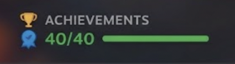

# Steam Achievements
A [Decky Loader](https://decky.xyz/) plugin for Steam Deck that shows your achievement progress directly on the game's library page — no need to open the Steam overlay or scroll down to the achievements tab.




## Features
- Small badge overlaid on the library app page showing `X/Y` achievements unlocked, with a progress bar.
- Score color scales smoothly from red (0%) to green (100%) based on your completion percentage.
- A blue completion ribbon appears next to the score once you've unlocked 100% of a game's achievements.
- Automatically hides itself:
  - on non-Steam games / shortcuts with no achievement data,
  - once you scroll down into the native Activity / Your Stuff / Community / Game Info section (Steam already shows its own achievement progress there).
- Adjustable badge position (top-left, top-right, top-center) and horizontal/vertical offset from the plugin's Quick Access Menu settings panel.
- Toggle to show/hide the trophy icon next to the "ACHIEVEMENTS" label.
- Local caching (30 min) to avoid unnecessary lookups.
## How it works
The plugin patches the `/library/app/:appid` route to inject the badge. It first tries to read your achievement data directly from the Steam client itself (`SteamClient.Apps.GetMyAchievementsForApp`) — no account setup needed. If that's ever unavailable (e.g. a SteamOS update changes the internal API), it falls back to a small Python backend that calls the official [Steam Web API](https://steamcommunity.com/dev) (`ISteamUserStats/GetPlayerAchievements`) instead.
## Requirements
None for normal use — the badge reads achievement data directly from the Steam client.

The Steam Web API fallback (only used if the local method stops working) would additionally require a Steam Web API key, your SteamID64, and a public profile, but there's currently no settings UI for these since they're not needed in practice.
## Installation
1. Download the latest release ZIP (or clone this repo).
2. Transfer it to your Steam Deck.
3. Open the Decky Loader settings → **Developer** tab.
4. Select **Install Plugin from ZIP file** and pick the plugin ZIP.

   The ZIP must contain a single root folder named `steam-achievements/` (matching `plugin.json`'s `name` field), with `dist/`, `main.py`, `package.json`, `plugin.json`, and `README.md` inside it — not the files loose at the ZIP root.
## Configuration
1. Open the Quick Access Menu (`...` button) → **Steam Achievements**.
2. Adjust the badge's position and horizontal/vertical offset to your liking.
3. Toggle the trophy icon on/off next to the "ACHIEVEMENTS" label ("Trophy icon" button).
4. Open any Steam game's library page — the badge should appear automatically.
## Project structure
```
.
├── main.py        # Python backend: Steam Web API fallback, manages settings
├── dist/
│   └── index.js   # Frontend: badge UI, route patching, settings panel
├── plugin.json     # Decky plugin manifest
└── package.json    # Node package metadata (build tooling)
```
## Known limitations
- Only works for native Steam games with achievements — non-Steam shortcuts (EmuDeck/ROMs) are not supported.
- Relies on an undocumented internal Steam client API (`SteamClient.Apps.GetMyAchievementsForApp`), which could change or break in a future SteamOS/Steam client update.
## Credits
Built for personal use on Steam Deck. UI patching approach and Steam icon inspired by the open-source [Achievement Companion](https://github.com/CodeNode-Automation/achievement-companion) Decky plugin.
## License
GPL-2.0-or-later